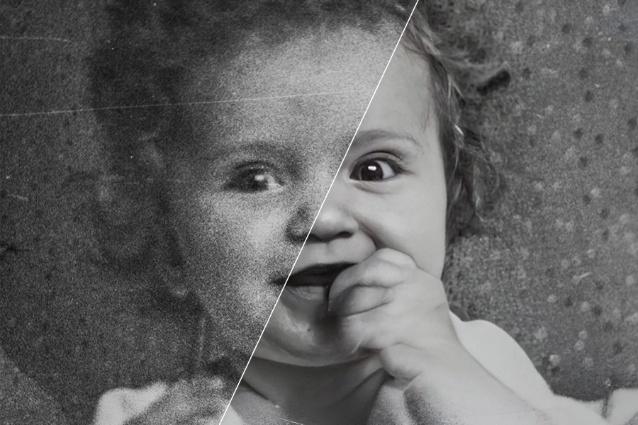

# Image Denoising

Images, especially photographs, are very susceptible to noise. Noises can be caused by countless factors, such as lighting conditions, sensor limitations, or transmission errors.

Machine learning techniques have become one of the most popular methods for image denoising. Autoencoder is one of the most popular neural network architectures for image denoising. In this project, I aim to develop a pseudo-autoencoder using statistical methods we have learned to tackle image noise.

## Autoencoder

Autoencoder is a type of neural network that learns to compress data (encoding) and then reconstruct the data back (decoding).

The bottleneck layer in between the encoding and decoding layers is where the data is compressed. The dimensionality of the bottleneck layer is usually lower than the input and output layers. This difference in the dimensionality forces the network to learn the most important features of the data and discard the noise. The compressed latent representation is then used to reconstruct the original data.

Typically, the original data to be compressed by the encoder consists of features learned from the neural network layers. The encoder and decoder also consists of multiple layers of neurons. The weights of the neurons are learned using the training data.

## Pseudo-Autoencoder

Neural networks can be computationally expensive for both training and inference especially with large datasets. They also require a lot of hyperparameter tuning, can be sensitive to the choice of architecture, and require a lot of data to train. 

In this project, I aim to use statistical methods to create a pseudo-autoencoder that can achieve similar results without the need for a neural network or machine learning.

Detailed walk-through of the project can be found [here](walkthrough.ipynb).
